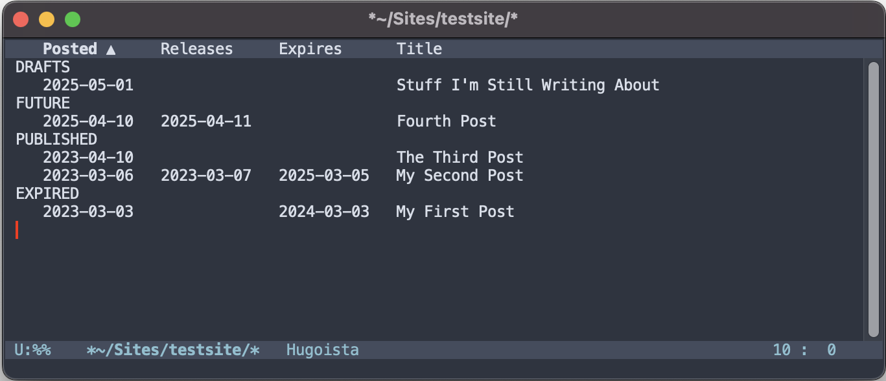

#+title: Syntax focused Common Lisp tree-sitter grammar

A very much WIP grammar for Common Lisp. [[https://github.com/tree-sitter-grammars/tree-sitter-commonlisp][Other implementations exist]] but with
this I focused specifically on the syntax of the language, so this grammar lacks
rules for things like "definition". Because of Lisp's extensibility, it doesn't
lend itself to a formal, authoritative definition of "intent" the way many other
languages' grammars permit. What I mean by that is
#+begin_src lisp
  (defmacro cool-defun (name args &body body)
    "😎"
    `(defun ,name ,args ,@body))
#+end_src
could break a grammar which hinges on ~CL:DEFUN~ as the "function_definition"
operator. This is a contrived example but you get the point.

"Syntax focused" does /not/ mean this grammar is simple. Some of the neat
features of this grammar:
- True nested block comments :: ~#| |#~ comments are represented as
  ~block_comment~ nodes, which can contain ~nested_comment~ children (identical
  rule, different name). Since that's a non-terminal rule, we cannot use [[https://tree-sitter.github.io/tree-sitter/creating-parsers/3-writing-the-grammar.html#using-extras][extras]],
  *so we have to manually manage whitespace and comments*. This is a pain in the
  ass.
- Symbols are non-terminal :: Symbols are not represented as terminal token
  rules, but instead have a syntax tree like
  #+begin_example
    (interned_symbol
      package: (symbol_tokens `cl`)
      ":"
      name: (symbol_tokens `cons`))
  #+end_example
  ~symbol_tokens~ nodes can have ~single_escape~ and ~multiple_escape~ child nodes.
- A grammar for FORMAT directives :: This is a multi grammar repo, containing a
  separate [[file:grammars/format/grammar.js][grammar for FORMAT]]. The string ~"​~3[​~​:;hi~]"~ will generate a tree
  roughly like
  #+begin_example
    (format_string
      (format_group
        start: (format_directive "~" (numeric_parameter `3`) (directive_character `[`))
        (format_directive "~" ":" (directive_character `;`))
        (string_chars `hi`)
        end: (format_directive "~" (directive_character `]`))))
  #+end_example
I had to use an [[https://tree-sitter.github.io/tree-sitter/creating-parsers/4-external-scanners.html][external scanner]] for both [[file:grammars/cl/src/scanner.c][symbol]] and [[file:grammars/format/src/scanner.c][format directive]] parsing.
My C isn't great, feel free to let me know what I'm doing wrong.

* Emacs support
*Note*: If you wanna use this just know it is a WIP and I won't hesitate to make
drastic changes until it's closer to release-ready. So if you put any
customizations in your init make sure to read the diffs carefully before
updating. That said, see [[#quickstart]].

I also will probably split the Emacs libraries into separate repos. Again, be
careful upgrading.

This repo contains a [[file:cl-ts-mode.el][CL tree-sitter major mode]] and a very funky [[file:clparse.el][semantic
font-lock library]]. Shield your eyes:

#+ATTR_HTML: :width 700px

The font-lock library is currently called "clparse", but this will almost
certainly change. I don't want the prefix to clash with ~cl-lib~, so I'm
tentatively thinking "semantic-cl".

The most useful part of this mess by far is the ~FORMAT~ directive highlighting.
The fatigue of counting and squinting at format directives was a major
motivation for this entire project. If you have [[https://github.com/Fanael/rainbow-delimiters][rainbow-delimiters.el]] those
faces can be used to highlight paired directives based on depth. See the
different colors of the ~~>~ and ~~}~ in the screenshot. And the face for the
whitespace skipped by ~~<newline>~ directives (dashed underline in the
screenshot) is very helpful. If you're horrified by the rainbow, you can simply
customize every ~cl-ts-mode-format-*~ face to the same appearance. While the
format fontifying logic is implemented in ~cl-ts-mode~, currently the format
local parsers are only added by ~clparse~.

I took a *lot* of inspiration from elisp-scope.el (which should ship with
Emacs 31) and pushed it to its extreme. There are 9 faces for local functions,
variables, blocks and tags which are cycled through on successive local
bindings. I also added faces for a variety of types of symbols ("roles" in the
elisp-scope parlance) like ~LOOP~ keywords, slot names, macros and special
operators, declaration names, special faces for ~T~ and ~NIL~, and so on. The
boxes in the screenshot are from an additional minor mode
~clparse-highlight-mode~ which highlights local bindings at point.

Almost all of this hinges on communication with an inferior lisp. Currently only
[[https://github.com/joaotavora/sly][Sly]] is supported, but [[https://github.com/slime/slime][SLIME]] support should be super simple, just haven't gotten
around to it (patches welcome).

** Quick start
:PROPERTIES:
:CUSTOM_ID: quickstart
:END:
The only dependencies are Sly and ~cond*~ which is on ELPA and I believe ships
with Emacs 31+. I haven't tested this on Emacs 30 yet but it should work on 31
(31.0.9 prerelease is out now). It's not available yet on ELPA/MELPA, so clone
this repo, add eval something like this:

#+begin_src elisp :tangle yes :lexical yes
  (add-to-list 'load-path "/path/to/repo")

  ;; optional, but a good idea
  (byte-compile (locate-library "cl-ts-mode"))
  (byte-compile (locate-library "clparse"))

  (load "cl-ts-mode")
  (load "clparse")
  ;; or
  (require 'cl-ts-mode)
  (require 'clparse)

  ;; not recommended yet!
  ;; (setf (alist-get 'lisp-mode major-mode-remap-alist) 'cl-ts-mode)
#+end_src

In a Lisp file, activate the major-mode with ~M-x cl-ts-mode~, which will prompt
to install the grammars. Emacs must be built with tree-sitter support, which it
typically is.

For the semantic highlighting library, connect to a lisp first with ~M-x sly~,
then ~M-x clparse-mode~, and ~M-x clparse-highlight-mode~ if you're interested
in that.

** Some /clparse/ implementation details
Symbols are passed to the Lisp via a Sly channel, who reports back with the
attributes of the symbol. The database of symbols is stored in obarrays on the
Emacs side. One "universal" obarray contains the complete package qualified
symbol names, like ~COMMON-LISP::CONS~. Information about the symbols, like
whether they're defined as variables, functions, macros etc. are stored in their
~symbol-plist~. Individual packages have their own specialized obarrays, whose
symbols are verbatim substrings of text from buffers where we found an
~in-package~ form specifying that package. Those symbols' ~symbol-function~ is a
symbol in the aforementioned universal obarray (or nil if we couldn't resolve
it). It may sound a little complicated but it's pretty simple in practice. To
check if the symbol represented by a treesit-node is defined as a function:
#+begin_src elisp :tangle yes :lexical yes
  (get (symbol-function (intern (treesit-node-text NODE) package-obarray)) :definition)
#+end_src
Or more simply
#+begin_src elisp :tangle yes :lexical yes
  (get (clparse-canonicalize-node NODE) :definition)
#+end_src
Local variables/functions/blocks/tags are stored as a nested alist in the
dynamic variable ~clparse-locals~. The keys are keywords like ~:variables~, and
the value is ~(DEPTH . LOCALS)~, where each of ~LOCALS~ is
~(CANONICALIZED-SYMBOL TREESIT-NODE . FACE-LIST)~. Storing all of this in a
single variable is quite handy:
- When encountering a quasiquote or unquote, the value of ~clparse-locals~ is
  pushed to/popped from ~clparse-locals-stack~
- Supporting new types of bindings is trivial, just use a unique key in
  ~clparse-locals~
When parsing a binding form like ~let~, the macro ~clparse-with-new-env~ is used
to create a new entry from the innermost respective ~clparse-locals~ entry.
Bindings are then added by destructively pushing into the entry's ~cddr~, and
incrementing the depth in the ~cadr~.

*** TODO more details

* FIXMEs
Most of these are for ~clparse~, ~cl-ts-mode~ is much further along.
- [ ] SLIME support
- [ ] *TESTS* for both grammar and emacs stuff
- [ ] Possibly support CL-INTERPOL in the grammar
- [ ] ~treesit-range-settings~ for the format grammar, for those who don't want
  to use ~clparse~
- [ ] ~LOOP~ parsing hasn't been tested extensively.
- [ ] A lot of common macros need parsers, eg. ~ITERATE~
- [ ] Better integration with the inferior Lisp (automatically re-caching when
  files are loaded, defuns are evalled etc.)
- [ ] Better support for multiple buffers/packages. Right now there practically
  is none, ~clparse~ just commits to the current package any time it's
  activated. I'm thinking of using separate Sly/SLIME channels for each package.
- [ ] Better interaction between ~clparse-walk~ and ~clparse-apply-type~. I
  think that ~clparse-apply-type~ should be the one to decide whether its type
  applies based on the level of quoting of its argument. Right now this decision
  is very clumsily made by ~clparse-walk~.
- [ ] Some notion of an "expected value type", in order to correctly give ~slot~
  in ~(slot-value object (progn 'slot))~ the correct face. elisp-scope does an
  excellent job at this with ~elisp-scope-output-spec~. The complicating factor
  is the prevalence of nonlocal control transfer compared to Elisp. Ideally we
  would track the expected type at each ~CL:BLOCK~ for ~CL:RETURN-FROM~ to
  determine its argument's role. Another option is of course to just skip
  non-local exits entirely and only support tail position values.
