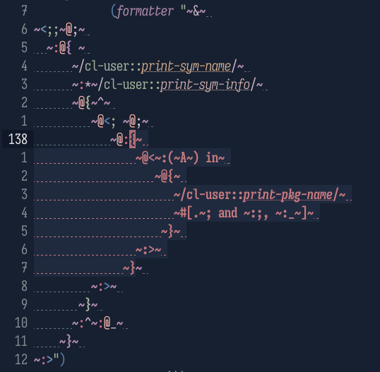

#+title: cl-ts-mode
#+options: toc:nil

A tree-sitter alternative to ~lisp-mode~ which uses [[https://codeberg.org/zshaftel/tree-sitter-cl-syntax][this grammar]].

#+toc: headlines 3
* Why?
The killer feature of this mode is the ~FORMAT~ string support. Using a
specialized embedded grammar for format strings enables format directive
font-lock and indentation. Trust me, the font-lock helps *a lot* when writing
intricate format strings. The indentation is more niche and can be customized or
simply disabled, see [[#format_indentation]].

A sample, showing off both indentation and font-lock:

#+caption: I actually wrote that before I made this package 😂

If this makes your eyes bleed, you can customize all those faces to look as
boring as you'd like.

The highlighted ~~​{​~​}~ directive after the cursor is from ~show-paren-mode~,
because ~cl-ts-mode~'s ~syntax-propertize-function~ adds delimiter syntax to
format directives. This also means ~forward-sexp~ moves across those directives
like it does on regular lists.

Aside from that, the truth is tree-sitter doesn't add nearly as much to most
Lisp languages *on its own* compared to other languages. Emacs' syntax system is
(unsurprisingly) extremely well suited to handling Lisp syntax (notably, it even
has first class support for nested comments unlike tree-sitter). *But* the CST
generated by tree-sitter enables some /very/ fancy semantic font-lock, see the
sister package [[https://codeberg.org/zshaftel/gaudy-cl][gaudy-cl]].

* Getting started
Not available on ELPA yet, so here are some examples of how to activate:
#+begin_src elisp :tangle yes :lexical yes
  (use-package cl-ts-mode
    ;; after running
    ;; git clone "https://codeberg.org/zshaftel/cl-ts-mode.git" /path/to/cl-ts-mode
    :load-path "/path/to/cl-ts-mode"
    ;; alternately, using package-vc-install
    :vc (cl-ts-mode :url "https://codeberg.org/zshaftel/cl-ts-mode.git"))
#+end_src
If you use [[https://github.com/progfolio/elpaca][elpaca]], you can use the following recipe:
#+begin_src elisp :tangle yes :lexical yes
  (elpaca (cl-ts-mode :host codeberg :repo "zshaftel/cl-ts-mode"))
#+end_src
For [[https://github.com/radian-software/straight.el][straight.el]]:
#+begin_src elisp :tangle yes :lexical yes
  (straight-use-package '(cl-ts-mode :type git :host codeberg :repo "zshaftel/cl-ts-mode"))
#+end_src
To automatically activate ~cl-ts-mode~ wherever ~lisp-mode~ normally activates, use
#+begin_src elisp :tangle yes :lexical yes
  (setf (alist-get 'lisp-mode major-mode-remap-alist) 'cl-ts-mode)
#+end_src
You can add this to the ~:init~ section of ~use-package~. Bear in mind that this
mode is not considered stable yet, so only do this if you're willing to risk some
jank.

I also recommend this snippet:
#+begin_src elisp :tangle yes :lexical yes
  (setf (alist-get 'cl-ts-mode font-lock-ignore)
        cl-ts-mode-font-lock-ignore-keywords)
#+end_src
You can place this in the ~:config~ section of ~use-package~. This disables
font-lock keywords which are already handled by the tree-sitter based font-lock
rules.

Lastly, the ~FORMAT~ string support is a separate minor mode,
~cl-ts-format-support-mode~. You can enable it with
#+begin_src elisp :tangle yes :lexical yes
  (add-hook 'cl-ts-mode-hook #'cl-ts-format-support-mode)
#+end_src
But if you use [[https://codeberg.org/zshaftel/gaudy-cl][gaudy-cl]], it will apply the grammar on its own (and much more).
* ~FORMAT~ directive indentation
:PROPERTIES:
:CUSTOM_ID: format_indentation
:END:
There is optional (but currently enabled by default) auto-indentation of format
directives. Still experimental. This is mainly to indent relative to the paired
directives (~~[~, ~~{~​, ~~(~ and ~~<~). Example:
#+begin_src lisp :tangle yes
  "~<
  ~A
   ~:>"
#+end_src
After pressing ~TAB~ on the second line:
#+begin_src lisp :tangle yes
  "~<~@
     ~A
   ~:>"
#+end_src
The directive is indented to the column after the ~~<~, and the newline is
converted to a ~~@<newline>~ directive so that the indentation of the output
isn't affected. The behavior depends on a few customizable variables:
- ~cl-ts-mode-format-indent-predicate~ :: A predicate for ~treesit-node-match-p~
  (usually a function or regexp matching a treesit node's type) to determine
  which nodes should have their /contents/ indented. By default it matches the
  four paired directives, but you can also set it to indent relative to the
  start of the entire format string. *To disable format indentation entirely,
  set it to nil.*
- ~cl-ts-mode-format-indent-auto-escape-eol~ :: Controls the behavior of the
  newline directive. It can be set to nil (don't indent if there isn't already a
  ~~<newline>~), t (don't add it but indent anyway), a string specifying the
  directive prefix to add, or a cons pair ~(LOGICAL-BLOCK . DEFAULT)~ to specify
  a different string (like ~~:@_~~) to use within ~~<​~:>~.
- ~cl-ts-mode-format-indent-tilde-relative~ ::
  # FIXME wow this is horrible wording
  Determines which column indentation is calculated relative to (using the
  following two variables), and the indentation of the end of a paired directive
  when it begins a line. If nil (the default), the directive characters
  themselves are aligned, like
  #+begin_src lisp :tangle yes
    "~:@{
       ~}"
  #+end_src
  If set to non-nil, the ~s are aligned:
  #+begin_src lisp :tangle yes
    "~:@{
     ~}"
  #+end_src
- ~cl-ts-mode-format-group-indent-offset~ :: Number of columns added to
  indentation relative to the start of a paired directive.
- ~cl-ts-mode-format-string-indent-offset~ :: Like the above but controls
  indentation relative to the start of the string, if that's enabled by
  ~cl-ts-mode-format-indent-predicate~.
* Font lock
There are distinct faces for every component of format directives I could think
of: ~~~, numeric, character, ~V~ and ~#~ parameters, the ~,~ separator between
parameters, ~:~ and ~@~ modifiers and the directive character itself all have
specific faces. The paired directives (~~[~, ~~{~​, ~~(~ and ~~<~) have a
separate face from other directives, and you can customize
~cl-ts-mode-format-rainbow-delimiters~ to use [[https://github.com/Fanael/rainbow-delimiters][rainbow-delimiters]] faces to
highlight those directives based on nesting level. There are also three faces
for each level of ~#||#~ comment nesting (the top level uses
~font-lock-comment-face~). See ~M-x customize-group RET cl-ts-mode~.
