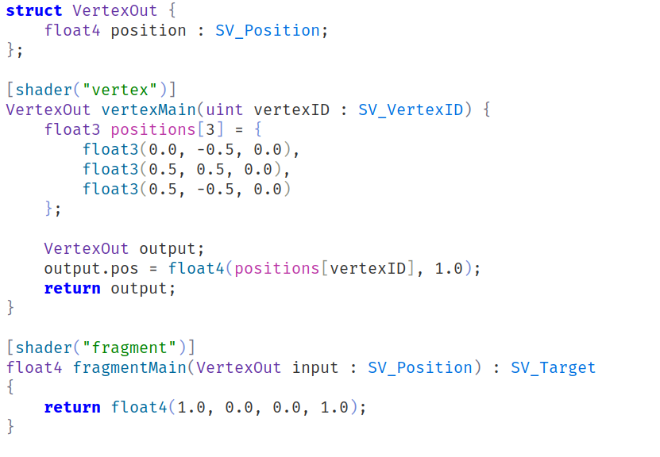
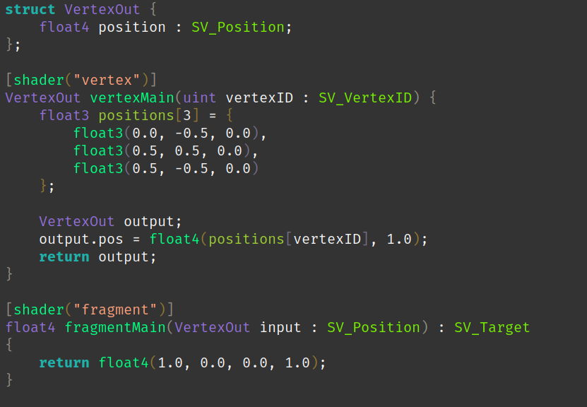

TITLE: slang-ts-mode

PROPERTY: LOGGING nil

This package provides slang-ts-mode, a major mode for editing [[https://shader-slang.org][Slang]] code powered by tree-sitter.

* Screenshots

** Light Mode

** Dark Mode

* Installation

The package is not on any repository yet. If you use Emacs 30+ then you can use package.el.

#+BEGIN_SRC=elisp
(use-package slang-ts-mode
  :vc (:url "https://codeberg.org/hikari/slang-ts-mode")
  :mode "\\.slang\\'")
#+END_SRC

Else, if you use straight.el or Elpaca,

#+BEGIN_SRC=elisp
;; For straight.el
(use-package slang-ts-mode
  :straight (:host codeberg :repo "hikari/slang-ts-mode" :branch "main")
  :mode "\\.slang\\'")

;; For Elpaca replace straight with ensure
#+END_SRC

* Customization

You can set the `slang-ts-indent-offset` variable (default 4) to change the indentation.

* Changelog

** 0.1

Initial release.

* License

GPLv2
